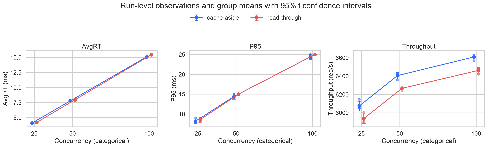
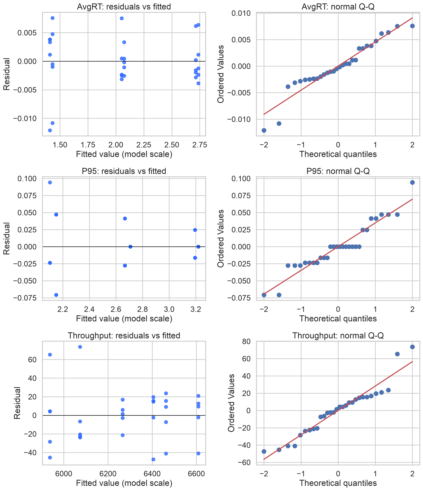

# Redis Cache Strategy Benchmark — Spring Boot + Redis + MySQL

A controlled benchmark comparing two server-side caching strategies in a Spring Boot application
backed by Redis and MySQL, measured across three concurrency levels.

**Dataset:** 2 strategies × 3 concurrency levels × 5 repetitions = **30 independent runs**
**Request-level records:** **11,325,558** samples
**Collected:** 2026-09-28 (single continuous session, 47 minutes)

> ### 📦 Where the data is
>
> | What you need | Where to get it |
> |---|---|
> | **Complete request-level data** (30 files, 11.3M records, 770 MB uncompressed) | **[GitHub Releases →](https://github.com/rys888/redis-cache-strategy-benchmark/releases/latest)** — file `formal-30runs-20260928.tar.gz` (66 MB) |
> | **Analysis-ready tables** (30 rows) | This repository: `data/run_level/run_level.csv` |
> | **Persistent archive + DOI** | Zenodo — [10.5281/zenodo.23011850](https://doi.org/10.5281/zenodo.23011850) |
>
> The raw JTL files are **not** stored in Git history (they would bloat the repository
> irreversibly). They live as a release asset. See [§6](#6-repository-contents).

---

## 1. Overview

This dataset captures the measured performance of two read-path caching strategies applied to the
same application, database and cache instance:

| Strategy | Where caching logic lives | Mechanism |
|---|---|---|
| **Cache-Aside** | Application code | Explicit `GET` / `SET` via `RedisTemplate` |
| **Read-Through** | Framework layer | Spring Cache `@Cacheable` managed by `RedisCacheManager` |

Both strategies are exercised through the same application process, the same repository layer,
the same SQL, the same key format, and the same request sequence, so that the measured
difference isolates **the caching access pattern** rather than incidental implementation drift.

**Measurement state:** Hot Cache — the working set is warmed before each run, and every run is
verified to have produced **zero database loads** and **zero cache misses** during the measurement
window (see §5).

---

## 2. Experimental design

| Item | Value |
|---|---|
| Factor A | `strategy` ∈ {`cache-aside`, `read-through`} |
| Factor B | `concurrency` ∈ {25, 50, 100} |
| Repetitions | 5 per cell |
| Total runs | **30** |
| Warm-up per run | 15 s (excluded from analysis) |
| Measurement window | 60 s |
| Cache state | Hot Cache (pre-warmed, no eviction expected) |
| Load generator | Apache JMeter 5.6.3 (separate host) |
| Application | Spring Boot 3.3.5, JDK 17, `-Xms1g -Xmx1g -XX:+UseG1GC` |
| Cache | Redis 7.2, TTL 300 s, `maxmemory 512mb`, `allkeys-lru` |
| Database | MySQL 8.0, 578 rows |

Within each repetition block, the six conditions are executed in randomized order
(recorded in `order_in_block`).

### Topology

```
  Load generator (8 vCPU)                Application host (4 vCPU)
┌───────────────────────┐              ┌──────────────────────────┐
│  Apache JMeter 5.6.3  │◀── private ──│  Spring Boot :8081       │
│                       │   network    │  ├── Redis 7.2           │
└───────────────────────┘   RTT 0.21ms │  └── MySQL 8.0 (578 rows)│
                                       └──────────────────────────┘
```

The load generator runs on a **separate host** connected over a private network
(measured round-trip time 0.21 ms). Colocating the generator with the application was found to
consume approximately one CPU core, which capped measured throughput and did **not** represent
application capacity.

### Per-run protocol

```
1. FLUSHDB                     clear the cache
2. Warm up 20 fixed IDs        through the strategy's real code path
3. Verify keys and TTL         20/20 present, TTL covers the 75 s window
4. RESETSTAT + reset probes    disable hot-path hit counter (see §4)
5. Stabilize                   5 s
6. JMeter                     15 s ramp-up + 60 s measurement
7. Validity gate               7 checks; any failure invalidates the run
8. Record metadata, cool down  10 s
```

---

## 3. Measured results

Means over 5 runs per cell.

| Strategy | Concurrency | AvgRT (ms) | MedianRT (ms) | P95 (ms) | Throughput (req/s) |
|---|---|---|---|---|---|
| cache-aside | 25 | 4.097 | 4.0 | 8.2 | 6,073 |
| cache-aside | 50 | 7.782 | 7.0 | 14.4 | 6,405 |
| cache-aside | 100 | 15.100 | 14.2 | 24.4 | 6,609 |
| read-through | 25 | 4.192 | 4.0 | 8.6 | 5,937 |
| read-through | 50 | 7.954 | 7.0 | 15.0 | 6,266 |
| read-through | 100 | 15.437 | 15.0 | 25.0 | 6,462 |

### Statistical summary

Models fitted on the run-level data (N=30) with HC3 heteroskedasticity-robust standard errors.

| Response | Read-Through vs Cache-Aside | Strategy p | Interaction p |
|---|---|---|---|
| log AvgRT | **+2.25%** [1.82%, 2.68%] | 8.7×10⁻¹¹ | 0.983 |
| log P95 | +3.84% [0.53%, 7.26%] | 0.0245 | 0.683 |
| Throughput | **−140.5 req/s** [−166.6, −114.4] | 6.0×10⁻¹¹ | 0.932 |

- **Concurrency effect:** AvgRT rises from 4.14 ms to 15.27 ms (**×3.7**) while throughput rises
  only 8.8% (6,005 → 6,536 req/s) — the system is throughput-saturated across all three levels.
- **Interaction:** not detected (p = 0.983 / 0.683 / 0.932; leave-one-out stable in 30/30 models).

### Figures

**Cell means across conditions** — the 30 run-level observations (dots), cell means, and 95%
t intervals with df=4:



**Model diagnostics** — residual-versus-fitted and Q-Q plots for the three main models:



See `analysis/statistical_report.md` for the complete report and `docs/DATASET.md` for field-level
documentation.

---

## 4. Fairness controls

Both strategies share the same application process, `DataSource`, `RedisConnectionFactory`,
DTO, mapping code, repository method, SQL, Redis key format (`laureate:{id}`), TTL (300 s),
JSON serializer, and request ID sequence (20 IDs cycled 1–20).

**Hot-path probe symmetry.** Cache-Aside increments an `AtomicLong` on *every cache hit*, while
Read-Through hits are intercepted by `@Cacheable` and never execute the target method — so no
symmetric counter exists on that side. Given the small effect size (≈0.1–0.34 ms), this
asymmetry was disabled during measurement via `POST /admin/probe?enabled=false`.
The `dbLoadCount` probe was retained because it increments only on the miss path.

---

## 5. Validity gates

Every run is automatically checked. If any check fails, the run is **not** recorded in the index
and the session is aborted.

| Check | Criterion | Purpose |
|---|---|---|
| Warm-up complete | `existCount == 20` | all 20 keys present |
| TTL coverage | `minPttl >= 75 s` | no expiry during measurement |
| **No DB load** | `dbLoadCount == 0` | proves Hot Cache steady state |
| **No cache miss** | `keyspace_misses == 0` | independent confirmation |
| Keys survive | still 20/20 after run | no unexpected eviction |
| JTL non-empty | sample count > 0 | excludes no-op runs |
| Window sane | 55–65 s | excludes abnormal termination |

**All 30 runs passed. Zero runs were invalidated.**

---

## 6. Repository contents

```
.
├── README.md
├── CITATION.cff
├── LICENSE
├── data/
│   ├── run_level/            ★ analysis-ready, one row per run
│   │   ├── run_level.csv         30 rows × 15 columns
│   │   ├── descriptive_stats.csv  6 rows (strategy × concurrency)
│   │   └── runs_index.csv        30 rows, environment metadata
│   └── raw/
│       └── meta/                 60 probe snapshots (30 JSON + 30 window stats)
├── analysis/                12 files: statistical report, coefficient tables,
│                            effect sizes, assumption tests, LOO, figures
├── experiment-plan/
│   ├── cache_experiment.jmx      JMeter test plan
│   └── id_pool.csv               the 20 fixed primary IDs
├── scripts/
│   └── analysis_run_level.py     reproduces the full statistical analysis
└── docs/
    └── DATASET.md                field-level data dictionary
```

### Complete raw data — download from Releases

The **complete request-level dataset** is distributed as a **release asset**, not stored in Git
history (committing 770 MB would bloat the repository irreversibly).

> **➡️ [Download the latest release](https://github.com/rys888/redis-cache-strategy-benchmark/releases/latest)**
>
> File: **`formal-30runs-20260928.tar.gz`** — 66 MB compressed, 770 MB uncompressed
>
> SHA-256 / MD5 of the archive are printed in the release notes.

Unpacking the archive gives:

```
formal-30runs/results/
├── jtl/                 30 JTL files — 11,325,558 request-level records
├── meta/                30 probe snapshots (.stats.json) + 30 window statistics (.jtlstats)
├── summary/             analysis-ready tables — same files as data/run_level/ here
│   └── analysis/        full statistical output — same files as analysis/ here
└── logs/                60 JMeter console logs (host identifiers redacted)
```

The same archive is also deposited on Zenodo and citable via DOI
**[10.5281/zenodo.23011850](https://doi.org/10.5281/zenodo.23011850)**.

For parsing guidance and a field-by-field schema, see `docs/DATASET.md`.

---

## 7. Usage

### Load the analysis-ready data

```python
import pandas as pd

df = pd.read_csv("data/run_level/run_level.csv")
print(df.groupby(["strategy", "concurrency"])[["AvgRT", "P95", "Throughput"]].agg(["mean", "std"]))
```

### Reproduce the statistics

```bash
pip install pandas numpy scipy matplotlib seaborn
python scripts/analysis_run_level.py     # ~12 s
```

Outputs are written to `analysis/`. Re-running reproduces all CSV outputs byte-for-byte;
only the PNG figures differ (matplotlib rendering).

---

## 8. Known limitations

**Effect sizes are inflated by an unusually stable environment.** Standardized effect sizes are
large (Cohen's d = 3.3–6.3; partial η² = 0.86 for strategy) while the relative effect is only
≈2.2%. The cause is the denominator: between-run variability is tiny (AvgRT SD 0.017–0.062 ms)
because the measurement state is rigorously controlled. Report effects in original units and
percentages, not as standardized magnitudes.

**P95 is weakly resolved.** The JTL `elapsed` field is integer milliseconds, so P95 is quantized.
Read-Through shows zero within-cell SD at concurrency 50 and 100 (all five runs identical).
Leave-one-out shows the P95 effect is significant in only 1 of 30 models at concurrency 25.
Treat P95 as a secondary metric.

**All concurrency levels are in the saturated region.** A 4× increase in offered load raises
latency 3.7× but throughput only 8.8%. `concurrency` must be treated as a categorical variable;
no linear extrapolation is valid.

**Interaction has limited power.** With 5 runs per cell, the interaction test has limited degrees
of freedom. The correct statement is "no interaction was detected", not "no interaction exists".

**Cross-host network overhead.** The private-network hop adds ≈0.4–0.5 ms round trip, about 12%
of the measured AvgRT at concurrency 25. This is common-mode across strategies and does not
affect the between-strategy comparison.

**Scope.** Single application instance, single dataset size (578 rows), single session. The two
strategies necessarily differ in code path (explicit `GET` vs. Spring Cache proxy), so results
describe **these two implementations**, not caching architectures in general.

---

## 9. License

- **Data** (`data/`, `analysis/`): CC BY 4.0 — see `LICENSE`
- **Scripts** (`scripts/`): MIT
- **Underlying business data:** Nobel Prize laureate records (public dataset, 578 records)

Database and cache credentials in the test configuration are fixed placeholder values intended
for an isolated benchmark environment only.

---

## 10. Citation

See `CITATION.cff`, or use:

```bibtex
@dataset{redis_cache_strategy_benchmark_2026,
  title     = {Redis Cache Strategy Benchmark: Cache-Aside vs. Framework-Managed
               Read-Through in Spring Boot under Concurrent Load},
  author    = {Ren, Yishun},
  year      = {2026},
  publisher = {Zenodo},
  doi       = {10.5281/zenodo.23011850},
  note      = {30 independent runs, 11,325,558 request-level records}
}
```
